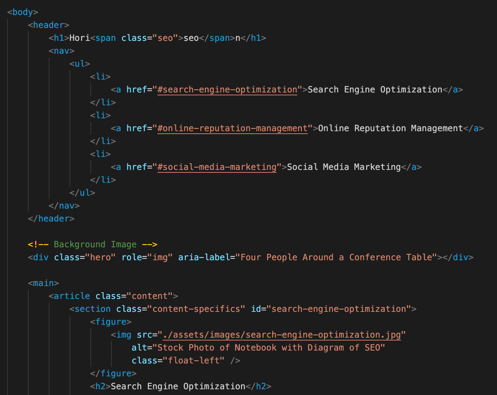

# Horiseon Webpage (Code Refactor Assignment)

## Description

This project was completed in order to refactor already-existing code to meet accessibility standards. The HTML and CSS files were updated accordingly, in order to make the website more accesible to assistive technologies and to opitimize the website. 

## Installation

This is a simple index.html file that can be opened in browsers and has been deployed to a GitHub page. 

## Use

A simple webpage about managing an online business:  
  
  
  See the deployed site [here](https://msteblu.github.io/horiseon_refactor/).
  
*Updating accessibility standards:*
Updating the HTML file with semantic elements: 
  
 
Updating the CSS file to be more accesible: 
  
 
  
## Credits

The original code was provided by the University of Minnesota Coding Boot Camp. 

## License

[MIT](https://github.com/microsoft/vscode/blob/main/LICENSE.txt) license. 
